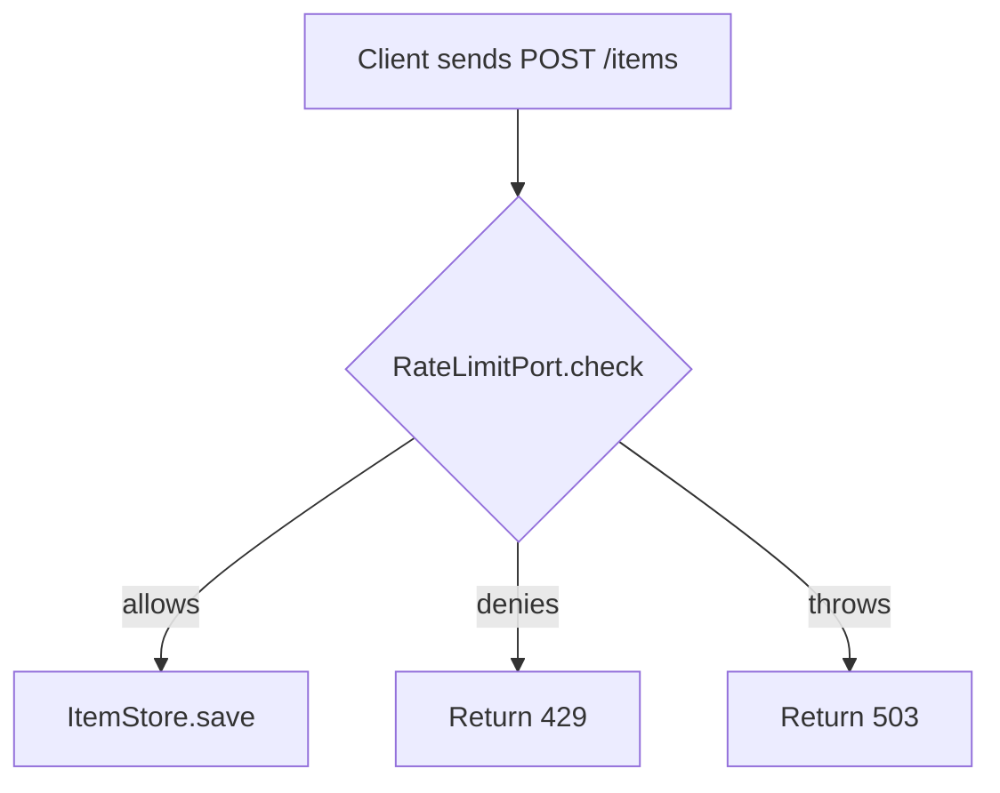

# Patterns for teachable technical documentation

Read this reference when a subject needs an explanation page, an impact warning, a diagram, an example, or an archive split.

## Explain a guarded action

Weak:

> Anonymous durable operations fail closed when their limiter is unavailable.

Clear:

> If `RateLimitPort.check` throws, `POST /items` returns 503 before `ItemStore.save`. No item is created.

Then explain why: the outage result prevents a broken limiter from reopening an unbounded write path.

## Show an impact warning

```markdown
> [!WARNING]
> If `trustProxy` includes a hop that clients can reach directly, a caller can supply the forwarded IP address that selects its rate-limit bucket. Configure only the proxies that actually sit in front of the service.
```

The warning names the configuration, attacker capability, observable consequence, and corrective action.

## Show a decision flow

Use a flowchart when a reader must understand several branches:



Keep the labels exact. If a branch returns before parsing or persistence, show that order.

## Link reference to explanation

A reference table can remain dry:

| Call | Denial | Exception | Side effects before check |
| --- | --- | --- | --- |
| `POST /items` | 429 | 503 | None |

Follow it with one sentence: "For the threat and outage reasoning, see [Why item creation fails closed](../explanation/item-rate-limit.md)."

Do not put the argument inside the table. Do not make readers infer behavior from the explanation when they need an exact lookup.

## Write a complete example

State the context:

> This example runs one process behind one trusted proxy. It does not demonstrate a multi-replica limiter.

Give the smallest copyable configuration:

```ts
const app = fastify({ trustProxy: "10.0.0.0/8" });
```

State the expected result:

> A request through that proxy uses the validated client address. A direct request cannot select a bucket through `X-Forwarded-For`.

State the failure result when it matters:

> If the actual proxy address is outside that range, callers share the proxy's bucket.

## Archive without losing evidence

Keep the old public path as a forwarding page when links may exist:

```markdown
# Verification history moved

The dated receipts are in the [verification archive](archive/verification-history.md). Current status is in [Verification status](verification-status.md).
```

Group archive material under dated headings. Add a banner that limits each claim to its named version, commit, client, and environment. Current pages should summarize the latest applicable result and link to the archived receipt.

## Replace internal labels with reader language

Weak current heading:

```markdown
## S4a shipped
```

Clear current heading:

```markdown
## Generic OIDC and Google
```

An internal batch identifier tells the reader when maintainers worked on something, not what the product does. Keep the old identifier only in a dated archive when a historical test table or receipt depends on it.

## Test whether the docs teach

For each major mechanism, ask a reader to answer:

- What problem does it prevent?
- Which exact endpoint, method, or field enforces it?
- What happens when it works?
- What happens when it fails?
- Which page is current?
- Where is the older evidence?

If the answers require reconstructing the system from scattered contracts, add or repair the explanation layer.
